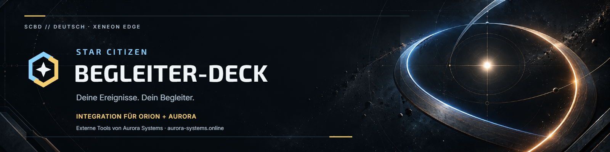

<p align="center"></p>

# Star Citizen Begleiter-Deck

**Orion und Aurora sind externe Tools von [Aurora Systems](https://www.aurora-systems.online/).
Sie wurden nicht von KayKaspers oder diesem Projekt entwickelt. Das Begleiter-Deck
ist eine unabhängige Integration dieser separat betriebenen Tools.**

Ein deutsches Ereignis-Deck für **Orion und Aurora**, optimiert für das
**Corsair XENEON EDGE mit 2560 × 720 Pixeln**. Orion spricht mit männlicher,
Aurora mit weiblicher deutscher Stimme. Die Sprachausgabe kommt weiterhin
aus dem jeweiligen Log-Wächter.

Das Deck zeigt standardmäßig die vom gewählten Begleiter gemeldeten
Reaktionsereignisse. **Weitere Logs** ergänzt das Spielprotokoll. Große Schrift,
Textfilter, Kategorien und automatisches Scrollen helfen beim Lesen im Spiel.
Der Begleiter bleibt ein separates Windows-Fenster und wird im rechten Bereich
positioniert; beim normalen Beenden wird seine ursprüngliche Position wiederhergestellt.

## Installation und Start

Die Ausgabe **0.1.0** wird zur Veröffentlichung vorbereitet; auf GitHub wurde noch
kein Release veröffentlicht. Unterstützt: Windows 10 ab 1809 oder Windows 11,
64 Bit (x64), mit XENEON EDGE als normalem Desktop-Monitor.

1. Den Installer ausführen. Er installiert für dein Benutzerkonto; .NET ist enthalten.
   Falls WebView2 fehlt, wird es über Microsoft nachinstalliert (Internet erforderlich).
2. Orion oder Aurora von Aurora Systems separat starten.
3. In iCUE **Bildschirmeinrichtung → Desktop** einstellen.
4. **Begleiter-Deck** starten. Beim ersten Start den Begleiter und die Ereignisdatei
   wählen. Der passende Standardpfad unter Dokumente wird vorgeschlagen.
5. Die Einrichtung sucht automatisch nach **Game.log** in typischen LIVE-Ordnern
   auf lokalen Laufwerken. Einen Treffer prüfen, bei mehreren Treffern auswählen.
   Alternativ die Datei manuell auswählen. Sie kann auf jedem lokalen Laufwerk liegen;
   es gibt keine Vorgabe auf Laufwerk D:. Ohne Game.log bleibt „Nur Begleiter“ verfügbar.

Die Einrichtung speichert ausschließlich deine lokalen Einstellungen unter
`%LOCALAPPDATA%\StarCitizenCompanionDeck\config.json`. Sie werden nicht ins
Repository aufgenommen. Für spätere Änderungen im Startmenü
**Begleiter-Deck einrichten** verwenden und eine laufende Sitzung vorher schließen.
Bei der Deinstallation bleiben diese Einstellungen erhalten.
Der Deinstaller schließt das laufende Deck regulär und wartet auf das Prozessende.
Wenn das nicht gelingt, bricht er vor dem Entfernen von Dateien ab. Mehrfachstarts
des Decks innerhalb derselben Windows-Sitzung werden verhindert.

**Escape** beendet die Anwendung und gibt das Begleiterfenster zurück.
**F11** wechselt den Fenstermodus. Die Oberfläche hat keine Begleiter-Auswahlliste;
die Einrichtung bestimmt, welches separat gestartete Tool verbunden wird.
Die Designauswahl wird lokal gespeichert. Spielprotokolle bleiben unverändert.

## Benutzerhandbuch

[Benutzerhandbuch als PDF](docs/Benutzerhandbuch.pdf) mit Installation, Einrichtung,
Bedienung, Designs und Fehlerbehebung. Der Installer liefert es mit und legt den
Startmenü-Eintrag **Begleiter-Deck Benutzerhandbuch** an. Im portablen Paket liegt
es neben der Programmdatei. Die [Textfassung](docs/BENUTZERHANDBUCH.md) ist ebenfalls verfügbar.

## Techdemo

Die 40-Sekunden-Techdemo erklärt vier Bedienungsschritte: Begleiter-Reaktionen
live lesen, Kategorien wählen, weitere Logs zuschalten und das Herstellerdesign wechseln.

https://github.com/user-attachments/assets/b89f3202-57ac-494d-82a7-8f1df2c6df0a

Mit dem Player direkt hier abspielen; das Video enthält Originalton und ruhige Musik.
[Techdemo als MP4 herunterladen](docs/media/techdemo.mp4).
[Medienquellen und Musikcredits](docs/VIDEO-MEDIEN-V2.md).

## Entwicklung

Zum Bauen: .NET SDK 8.0.425; zum Prüfen der Oberfläche zusätzlich Node.js ab 22.
Private JSON-Konfigurationen lassen sich weiterhin ausdrücklich übergeben:

```powershell
./runtime/Start-Runtime.ps1 -ConfigPath 'C:\EigeneDateien\deck.json' -PlaceExternal
```

Die Beispieldateien unter runtime/ enthalten keine persönlichen Spielpfade.
[Release-Build und Installationsprüfung](release/README.md) dokumentieren den
reproduzierbaren Installer und das portable Paket.

## Designs und Brand-Kit

Zusätzlich zum neutralen Deck-Design gibt es **15 Herstellerdesigns**: RSI,
Anvil, Aegis, Drake, Origin, Crusader, MISC, Argo, Banu, Consolidated Outland,
Esperia (Tevarin), Kruger, Mirai, Vanduul und Aopoa. Damit sind alle Gruppen der
vom Maintainer verlinkten deutschen Herstellerliste abgedeckt.
Die Designs variieren Farben, Rahmen, Formen und
Typografie. Sie sind eigene Interpretationen der Herstellerstile und enthalten
keine übernommenen Herstellerlogos oder Schiffsbilder.

- [Recherche und Gestaltung der Designs](docs/THEMEN-RECHERCHE.md)
- [Brand-Kit mit Zeichen, Wortmarke und Banner](branding/BRAND-KIT.md)
- [Konfiguration und Begleiterwechsel](docs/KONFIGURATION.md)
- [Architektur und technische Grenzen](docs/ARCHITEKTUR.md)
- [Prüfergebnisse](evidence/PRUEFUNG-2026-10-03.md)

## Prüfen

```powershell
npm ci
./runtime/Test-Runtime.ps1 -IncludeWebChecks
```

Node.js ab Version 22 wird nur für Browserprüfungen benötigt. Unter Windows
nutzen diese den installierten Microsoft Edge; auf anderen Systemen muss der
Playwright-Browser bereitstehen. Die eigentliche Anwendung benötigt weder
Node.js noch einen Webserver, NDF oder CDS.

## Abgrenzung

Das Deck liest lokale Dateien und übernimmt Fensterpositionierung. Es verändert
keine Begleiter-Binärdateien, bettet keine fremden WPF-Fenster ein und übernimmt
keine Sprach-, Roboter- oder sonstigen Begleiter-Assets. Ereignisse bestätigen
die Meldung des Wächters, nicht die erfolgreiche Audiowiedergabe.
Ältere Meldungen werden gekennzeichnet. Schiff und Standort werden nicht
allein aus beliebigen Entity-Namen als aktueller Spielerzustand behauptet.

Ein unabhängiges Community-Projekt. Star Citizen und die genannten Hersteller
gehören zu ihren jeweiligen Rechteinhabern; es besteht keine offizielle
Verbindung zu Cloud Imperium Games, Roberts Space Industries oder Corsair.
